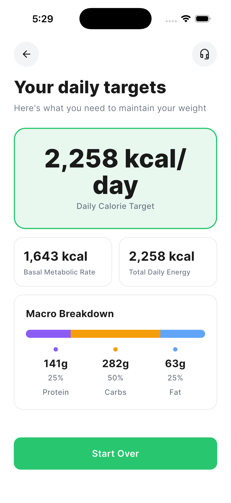
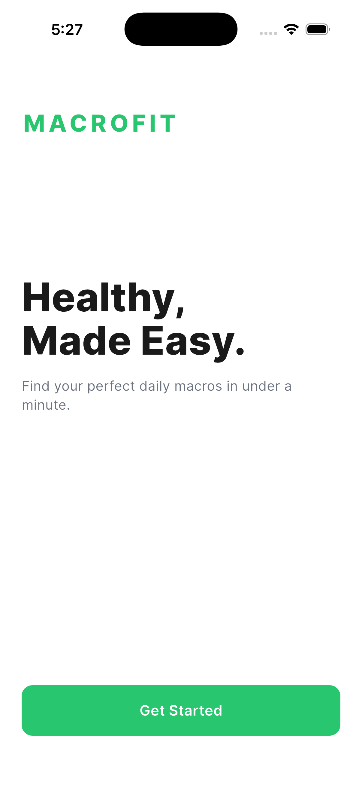
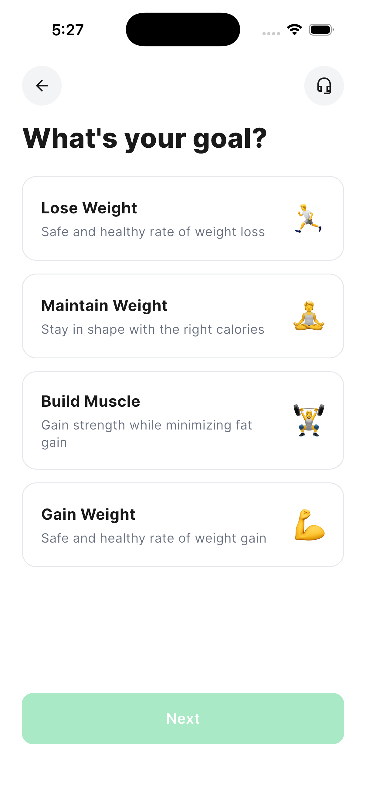
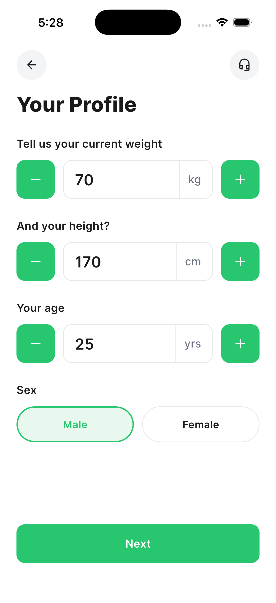
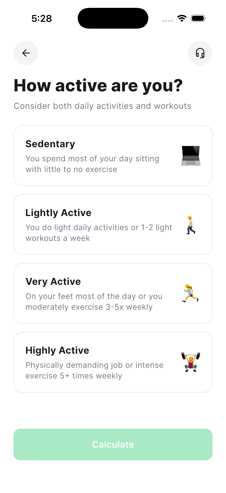

# MacroFit

A Flutter portfolio piece — a five-screen onboarding flow that turns weight, height, age, sex, activity level, and a fitness goal into a personalised daily calorie and macronutrient target.



## Why I built this

I wanted a small, single-purpose mobile app I could point to as proof of work — clean Flutter UI on the surface, a real nutrition algorithm underneath. The five-screen onboarding is the kind of flow nutrition and fitness apps ship every day; it's a tight scope that lets the design language and the math do the talking instead of hiding behind feature breadth.

## Features

- 5-screen onboarding flow: welcome → goal → profile → activity → results
- Mifflin-St Jeor BMR, activity-multiplier TDEE, goal-adjusted daily calories
- Macro split tailored to the chosen goal, shown as grams + percent + a stacked bar
- Cohesive visual design: green primary, light selected-state tint, rounded cards, circular icon buttons, Inter typography
- No backend, no persistence, no API calls — everything is computed locally on-device

## Calculation methodology

**BMR — Mifflin-St Jeor**

```
Male:   BMR = (10 × weight_kg) + (6.25 × height_cm) − (5 × age) + 5
Female: BMR = (10 × weight_kg) + (6.25 × height_cm) − (5 × age) − 161
```

**TDEE** = BMR × activity multiplier (Sedentary 1.2, Lightly Active 1.375, Very Active 1.55, Highly Active 1.725).

**Daily calories** = TDEE adjusted by goal: −500 (lose), 0 (maintain), +250 (build muscle), +500 (gain).

**Macro split** is fixed per goal and converted to grams using 4 kcal/g for protein and carbs, 9 kcal/g for fat:

| Goal          | Protein | Carbs | Fat |
|---------------|---------|-------|-----|
| Lose Weight   | 35%     | 40%   | 25% |
| Maintain      | 25%     | 50%   | 25% |
| Build Muscle  | 30%     | 50%   | 20% |
| Gain Weight   | 25%     | 55%   | 20% |

All of this lives in [`lib/services/macro_calculator.dart`](lib/services/macro_calculator.dart) as pure functions, with unit tests in [`test/macro_calculator_test.dart`](test/macro_calculator_test.dart).

## How I built it

Spec-first. I wrote the full build brief (preserved as [`SPEC.md`](SPEC.md)) covering screen flow, design tokens, calculation rules, and file structure, then scaffolded the implementation with Claude Code and refined it manually.

Things worth calling out:
- The calculator is a pure-Dart service with no Flutter imports — the easiest part of the codebase to point to and say "here's the algorithm."
- Every visual primitive (app bar, card, number input, primary button, macro bar) lives in `lib/widgets/` and takes typed props, so a redesign is mostly a token change in `lib/theme/`.
- An extra unit test covers the goal-delta math (+250/−500/etc.) since that's the part most likely to silently regress.

## Run it

```bash
flutter pub get
flutter run
```

Tested on iOS Simulator and Android Emulator. Runs on Flutter 3.41 / Dart 3.11.

```bash
flutter test       # runs the macro-calculator unit tests
flutter analyze    # static analysis, should report no issues
```

## Screenshots

| Welcome | Goal | Profile | Activity | Results |
|---------|------|---------|----------|---------|
|  |  |  |  |  |

## What I'd do next

- **Persist the profile** locally (shared_preferences / Hive) so reopening the app skips the flow
- **History view** showing past targets when weight/activity change over time
- **Meal logging** with progress bars against the daily target — the obvious next product step
- **Refine the formula**: support imperial units, add body-fat-percentage (Katch-McArdle) as an alternative BMR source
- **Goal recommendations** — surface "you'd hit your target weight in ~12 weeks at this rate" instead of just a number
- **Accessibility pass**: dynamic type, semantic labels on the icon buttons, sufficient hit targets on the stepper buttons
